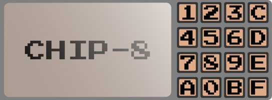

# Chip8

  
   
   

A golang CHIP-8 emulator. Still in early development.

## Features

- [ ] Success emulating test ROMs
- [ ] Sound support
- [ ] Support to choose colors
- [ ] Scaling factor
- [ ] ETI 660 address load
- [ ] ETI 660 display sizes
- [ ] Sprite wrapping options
- [ ] 'Adapted' or 'literal' keyboard maps
